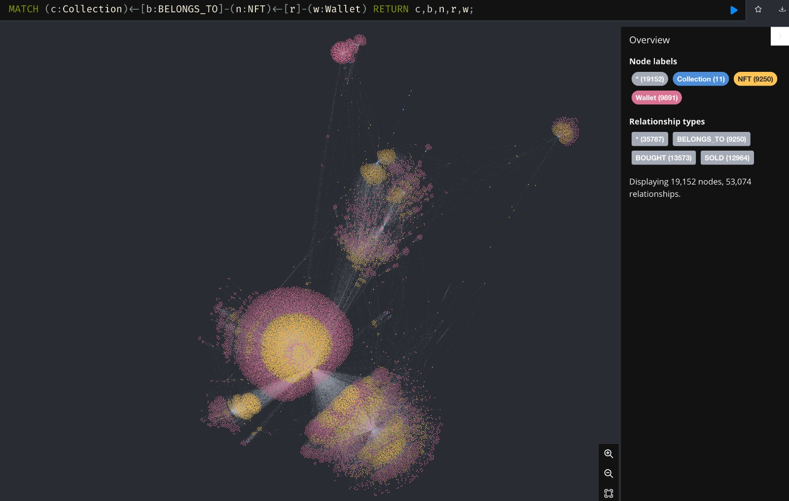

# tdlcapstone 2023: Web3 visualisation models
| [home page]() | [S1L Scope, Research, Requirements]() | [Solution Design]() | [Data Engineering]() | [Data Visualisation]() | [Files]() |

#### Project Introduction
We are a newly emerging company focusing on analytics for Web3. Conceived and started by Ari Lightman, Professor at Heinz :-). The company consists of Terry Boyd, Heinz graduate, and Kiran Rao, CMU graduate as well as board members Tom Pageler, CEO Prime Trust, Bob Schukai, EVP, Mastercard and Jane Schactel, formers head of consulting advertising ecosystem at Meta

#### The capstone problem
Web3, tokenized goods and services, contain a variety of data associated with the offering including attributes. These are available on the blockchain and can be collected, organized and used as associations to determine clusters of similar Web 3 offerings. Similar to

#### Objectives of the project:
Develop models to visually explores clusters of Web3 offerings in this case NFTs. We will use a data broker developed by CMU alums to provide the data and attributes. The CMU team will use tools like Bloom - neo 4j to develop an interactive and visual graph vie of similar NFTs

# Highlighted Resources
Some useful documents. 

Project Brief
- [Project Brief: Token Dynamics Labs](docs/token-dynamics-labs.pdf){:target="_blank" rel="noopener"}
- [Capstone Project Guidelines](docs/23-Capstone-Handbook-2022-2023.pdf){:target="_blank" rel="noopener"}

Presentations
- [Midterm Presentation: Project Intro and plan](https://docs.google.com/presentation/d/1SNBDCgZWd3klnU6JdneC_vVuNNkvlXnU-oQ2_BjyA0c/edit?usp=sharing){:target="_blank" rel="noopener"}

Files and Documents

# Project Plan
- [x] Sprint 1: Scoping, Research and Requirements Specification
- [x] Sprint 2: Solution Design, Unit Testing
- [x] Sprint 3: Prototyping 
- [ ] **Sprint 4: Debugging and Improvement**
- [ ] Sprint 5: Product Deployment, Documentation
- [ ] Sprint 6: Partner Test Demo, Stakeholder alignment, Product Owner Review

# Stakeholders

| Sponsor      | Team Members | Partner Companies | Resource Persons  | Technologies           | 
|--------------|-------------|---------------------|--------|-----------------|
| Token Dynamics Lab          | Ruchi Bhatia, Product Manager         | Estee Lauder            |  Ari Lightman, Sponsor | Python       | 
|        | Yirun Wang (Eva), Assistant Product Manager         | Nakji                 |   Samuel Perl, Advisor  | MongoDB             | 
|  | Yuanmo Zhu (Caroline), Project Secretary/Quality Assurance        |             | Derrick Spooner | Neo4j | 
|  | Suet Ching Cheuk (Christy), Financial Secretary       |             | Nick Kharas  | Google Cloud SQL (MySQL)| 
|  | Michael Affare, Stakeholder Management       |             |  | Linux, Github, tmux | 

<!-- 
# About me
Hi!  I really like data.  And I like visualizations.  So I guess you can say that I like data visualizations!

# What I hope to learn
All the things - obviously. Maybe I want to make a list of all the things.  If so, I can do so in Markdown like this: 

1. List item #1
2. List item #2
3. List item #3

or...

- List item #1
- List item #2
- List item #3

# Portfolio

 #### Project Advisor
- Samuel Perl

#### Project team
- Ruchi Bhatia ; Product Manager
- Yirun Wang (Eva); Assistant Product Manager
- Yuanmo Zhu (Caroline); Project Secretary/Quality Assurance
- Suet Ching Cheuk (Christy); Financial Secretary
- Michael Affare; Stakeholder Management/Information Liaison 

# Examples
You can keep this section for stuff from in-class demos or your other work, or remove it. 

## Assignment: [Visualizing overnment Debt](visualizing-government-debt)
For this assignment, make sure you set up and link to a new page.  This page is linking to a new Markdown document called `visualizing-government-debt.md`.  For links to Markdown files in your repository, you can just include the name of the page without the `.md` extension. 

## Assignment 3&4: [Critique by Design](critique-by-design)
For this assignment, make sure you set up and link to a new page.  This page is linking to a new Markdown document called `critique-by-design.md`.  

## Final project
Here it might be helpful to include a high-level description of your final project. 
[Part I](final-project-part-one)
[Part II](final-project-part-two)
Part III(final-project-part-three) -->

<!-- ---
## Other stuff you can do (you can remove this section - it's just for your reference.)

### Changing text

You can change text, like this: 

**Here's some bold** text.  Here's some *italic* text. Here's some ~~strikethrough~~ text. 

### Creating tables

You can build tables like this: 

| Name         | Type of pet | Favority activity 1 | FA 2   | FA 3            | FA 4                                |
|--------------|-------------|---------------------|--------|-----------------|-------------------------------------|
| Eli          | cat         | Sleeping            | Eating | Being pet       | Plotting to overthow dog empire     |
| Howard       | dog         | You                 | You    | You             | Eating                              |
| Frankenstein | fish        | Swimming            | Eating | Blowing bubbles | Forgetting                          |

An easy-to-use template generator tool [can be found here](https://www.tablesgenerator.com/markdown_tables)

You can use different headings, like this: 

# Here's a large title (H1)
## Here's a subtitle (H2)
### ...and so on (H3)
You get the idea - just don't forget the space between the # and your title.  `#Title` won't work, but `# Title` will. 

### Adding images

Here's an example of how to add an image to my portfolio.  

> Photo by <a href="https://unsplash.com/pt-br/@charlesdeluvio?utm_source=unsplash&utm_medium=referral&utm_content=creditCopyText">charlesdeluvio</a> on <a href="https://unsplash.com/photos/K4mSJ7kc0As?utm_source=unsplash&utm_medium=referral&utm_content=creditCopyText">Unsplash</a>
  

Alternately, you can set the size of the image using just a bit of HTML: 

Remember that you'll need to upload the image into your repository, or include a link to the image somewhere else.  

### Setting up a separate page

So here's the code you'll need to add to your own site to create a second page. 

1. First, create a new page in your repository (for example, dataviz1.md)
2. Next, add a link to that page by inserting the following into your readme.md page:

`[title](dataviz)` or `[dataviz](https://cmustudent.github.io/portfolio/dataviz.html)` or `[CMU](https://www.cmu.edu)`

Any of those formats will work. Here's some examples of working links: 

`[title](dataviz)` = [title](dataviz)  
`[dataviz](https://cmustudent.github.io/portfolio/dataviz.html)` = [dataviz](https://cmustudent.github.io/portfolio/dataviz.html)  
`[CMU](https://www.cmu.edu)` = [CMU](https://www.cmu.edu)   

Make sure to check these from your publicly accessible URL to make sure they're working correctly (not from the preview tab). 

Looking for more?  A nice Markdown guide [can be found here](https://www.markdownguide.org/cheat-sheet/) -->
